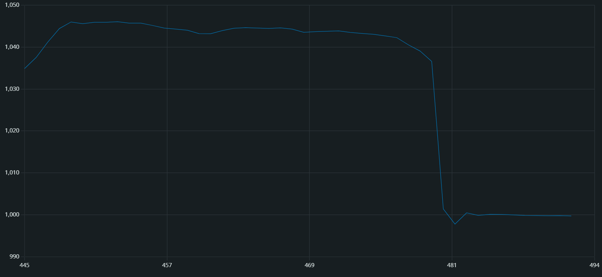

# 6/22

```cpp
const int SENSOR_PIN = A0;

void setup() {
    Serial.begin(115200);
    pinMode(2, INPUT);

}

void loop() {
    int value = analogRead(SENSOR_PIN);

    Serial.println(value);

    delay(100);
} 
```

先週まで上記のものでテストを行っていたものだが、どう考えてもI2Cで測定はできないものと思われる。

```cpp
#include <Adafruit_LPS35HW.h>

Adafruit_LPS35HW lps35hw = Adafruit_LPS35HW();

// For SPI mode, we need a CS pin
#define LPS_CS  10
// For software-SPI mode we need SCK/MOSI/MISO pins
#define LPS_SCK  13
#define LPS_MISO 12
#define LPS_MOSI 11

void setup() {
  Serial.begin(115200);
  // Wait until serial port is opened
  while (!Serial) { delay(1); }

  Serial.println("Adafruit LPS35HW Test");

  if (!lps35hw.begin_I2C()) {
  //if (!lps35hw.begin_SPI(LPS_CS)) {
  //if (!lps35hw.begin_SPI(LPS_CS, LPS_SCK, LPS_MISO, LPS_MOSI)) {
    Serial.println("Couldn't find LPS35HW chip");
    while (1);
  }
  Serial.println("Found LPS35HW chip");
}

void loop() {
  Serial.print("Temperature: ");
  Serial.print(lps35hw.readTemperature());
  Serial.println(" C");

  Serial.print("Pressure: ");
  Serial.print(lps35hw.readPressure());
  Serial.println(" hPa");

  Serial.println();
  delay(1000);
}
```
先程SPIによるテストとしてでたスケッチ例。本日はこれのテストから行う。

## テスト結果



吹く→止める

ピンを指で押さえる形で計測が出来たが、本格的にはんだ付けを行わなくては使えない。  
[はんだ付け](handa.md)