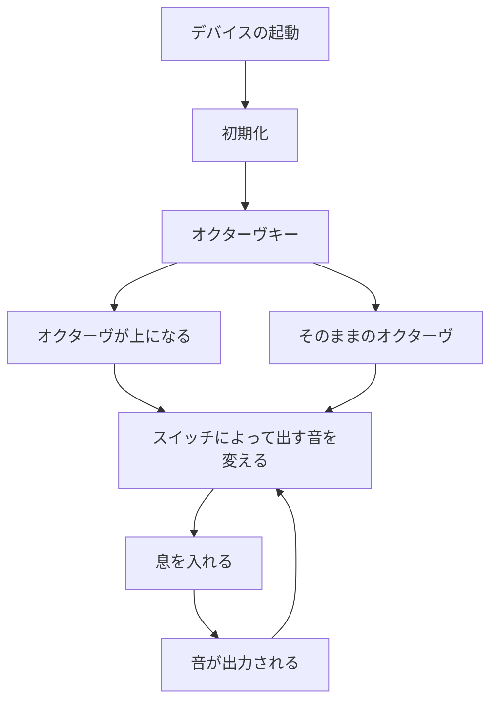

# テスト

## 楽器制作

## フローチャート

```mermaid
graph TD;
    デバイスの起動-->初期化;
    初期化-->オクターヴキー;
    息を入れる-->音が出力される;
    音が出力される-->スイッチによって出す音を変える;
    スイッチによって出す音を変える-->息を入れる;
    オクターヴキー-->オクターヴが上になる;
    オクターヴキー-->そのままのオクターヴ
    オクターヴが上になる-->スイッチによって出す音を変える;
    そのままのオクターヴ-->スイッチによって出す音を変える;
```
