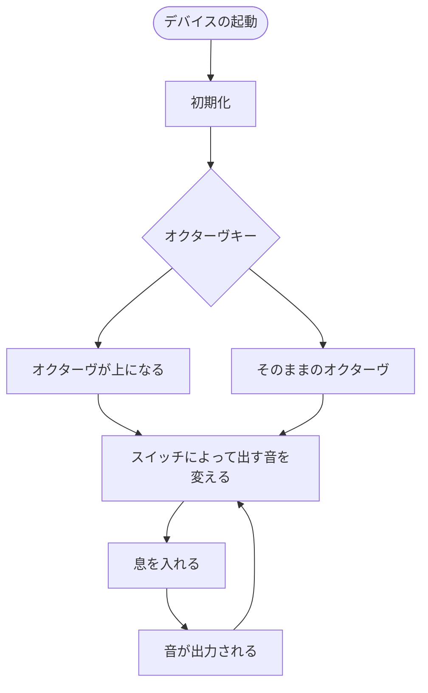

# テスト

## 楽器制作

## フローチャート

```mermaid
flowchart TD;
    a([デバイスの起動])-->初期化;
    初期化-->id1{オクターヴキー};
    息を入れる-->音が出力される;
    音が出力される-->スイッチによって出す音を変える;
    スイッチによって出す音を変える-->息を入れる;
    id1{オクターヴキー}-->オクターヴが上になる;
    id1{オクターヴキー}-->そのままのオクターヴ
    オクターヴが上になる-->スイッチによって出す音を変える;
    そのままのオクターヴ-->スイッチによって出す音を変える;
```
