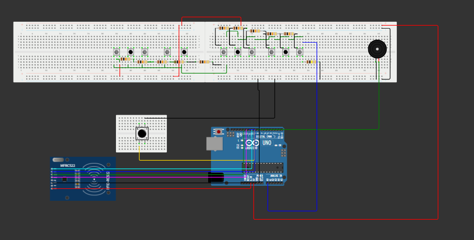
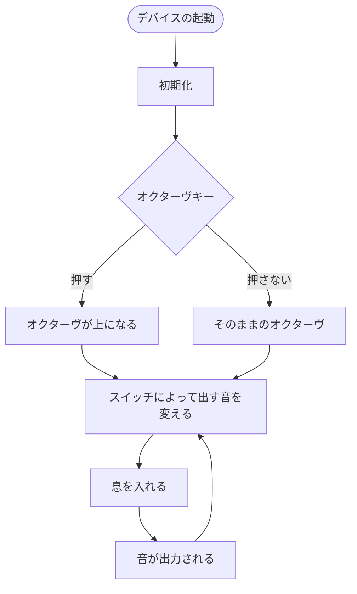

# 個人制作プロジェクト

[概要](https://github.com/nRen28/GraduationProject_vsShooting#概要)

## 概要

本プロジェクトはマイコンのArduino UNO R4 Wifiで製作する木管型の電子楽器です。

### 主な特徴

- 1オクターブ12音×2の切り替えが可能
- 2オクターヴの音域を出すことが可能
- 楽器に息を入れる事で音の出力をする
- 息の量によって音量の調整が可能
- 音の出力にはパッシブブザーを採用
- スイッチの配線はラダー型回路を採用
- 空気圧の検知にはSTEMMA QT/Qwiic互換 LPS33HW搭載 防水圧力センサを採用
- タンギングなどの細かい息の量の変化にも対応

## 構成

### ハードウェア構成

#### 使用パーツ

| 部品名 | 数量 | 備考 |
| ------ | ------ | ------ |
| Arduino UNO R4 WiFi | 1 | |
| ブレッドボード | 3 | うち1つはオクターブキー用に反対につける |
| 空気圧センサー | 1 | 防水機能あり |
| チューブ | 1 | 60cm程で直径は3cm |
| パッシブブザー | 1 | |
| オクターブキー | 1 | タクトスイッチ |
| タクトスイッチ | 12 | 柔らかいタクトスイッチを採用 |
| サランラップの棒 | 1 | 基盤やスイッチなどをこちらに貼り付ける |
| ジャンプワイヤー | 沢山 | およそ20本ほど |

### 配線図

空気圧センサーをRFIDで代用している。



### 使用ライブラリ

```c
#define TONE_USE_INT
#define TONE_PITCH 440
#include <TonePitch.h>
```

## フローチャート


