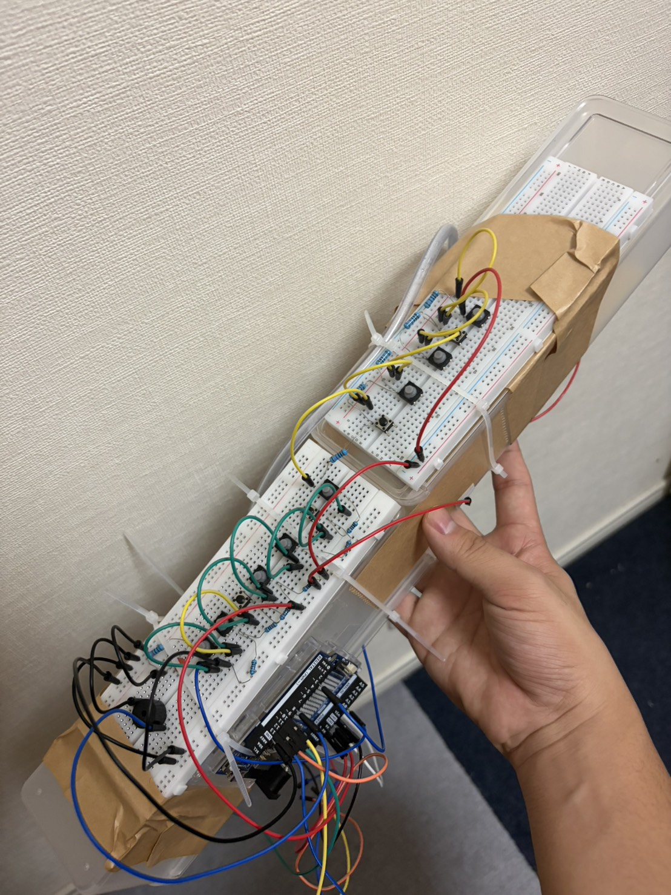
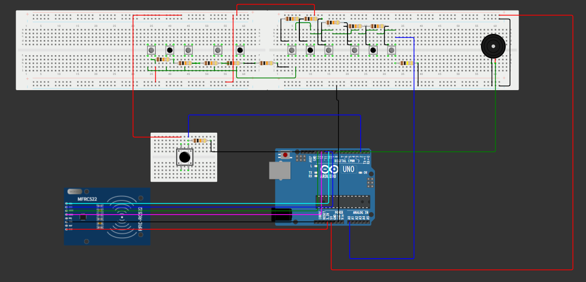
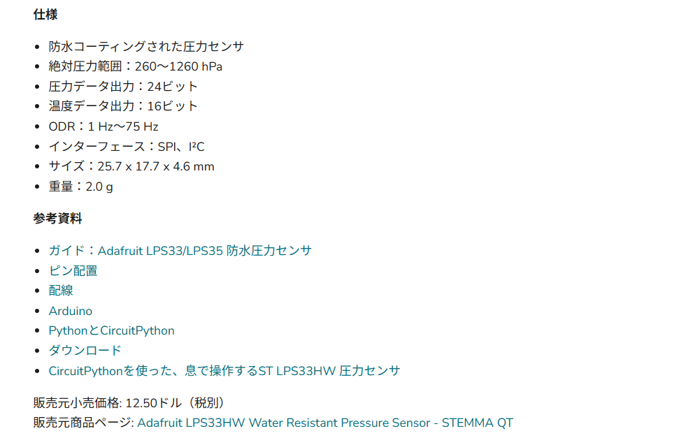
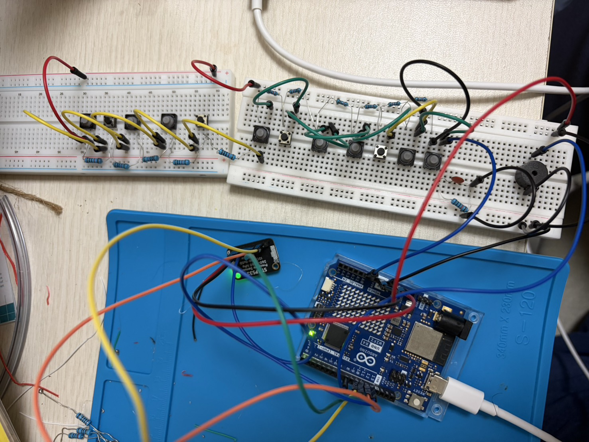
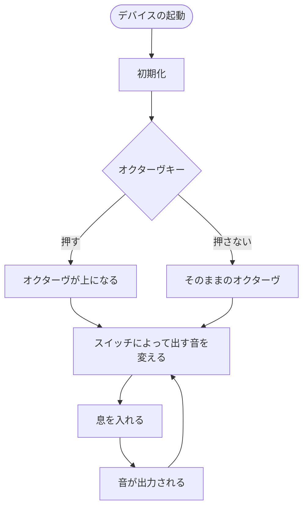

# 個人制作プロジェクト

[概要](https://github.com/nRen28/GraduationProject_vsShooting#概要)



## 概要

本プロジェクトはマイコンのArduino UNO R4 Wifiで製作する木管型の電子吹奏楽器です。

## 主な特徴

- 1オクターブ12音×2の切り替えが可能
- 2オクターヴの音域を出すことが可能
- 楽器に息を入れる事で音の出力をする
- 息の量によって音量の調整が可能
- 音の出力にはパッシブブザーを採用
- スイッチの配線はラダー型回路を採用
- 空気圧の検知にはSTEMMA QT/Qwiic互換 LPS33HW搭載 防水圧力センサを採用
- タンギングなどの細かい息の量の変化にも対応

## 構成

### ハードウェア構成

#### 使用パーツ

| 部品名 | 数量 | 備考 |
| ------ | ------ | ------ |
| Arduino UNO R4 WiFi | 1 | |
| ブレッドボード | 3 | うち1つはオクターブキー用に反対につける |
| 空気圧センサー | 1 | 防水機能あり |
| チューブ | 1 | 60cm程で直径は3cm |
| パッシブブザー | 1 | |
| オクターブキー | 1 | タクトスイッチ |
| タクトスイッチ | 12 | 柔らかいタクトスイッチを採用 |
| サランラップの棒 | 1 | 基盤やスイッチなどをこちらに貼り付ける |
| ジャンプワイヤー | 沢山 | およそ20本ほど |

### 配線図

空気圧センサーをRFIDで代用している。


### 配線について

半音も込みで計12このタクトスイッチとセンサーを使う都合でスイッチ一つ一つをピンに通すことは不可能と判断。  
ラダー型回路を使用してアナログ入力によって音程の調節を行う。  
[制作過程](haisen.md)

### 使用部品について

#### 空気圧センサー



今回インターフェースはSPIを使用。
[引用元](https://www.switch-science.com/products/6104/)

### 画像（基板のみ）




### 使用ライブラリ

```c
#define TONE_USE_INT
#define TONE_PITCH 440
#include <TonePitch.h>
```

### ソースコード

[こちらに記載](proto.c)

## フローチャート


```mermaid
flowchart TD;
    a([デバイスの起動])-->初期化;
    初期化-->id1{オクターヴキー};
    息を入れる-->音が出力される;
    音が出力される-->スイッチによって出す音を変える;
    スイッチによって出す音を変える-->息を入れる;
    id1{オクターヴキー}--押す-->オクターヴが上になる;
    id1{オクターヴキー}--押さない-->そのままのオクターヴ
    オクターヴが上になる-->スイッチによって出す音を変える;
    そのままのオクターヴ-->スイッチによって出す音を変える;
```

## 課題、欠点

- 配線が嵩張るため本来の楽器よりパフォーマンスしづらい
- ボタンを一つだけ押さないと正常な音程が反映されない為、本来の演奏パフォーマンスを発揮しづらい。
- ラダー型回路がブレッドボードで多数のスイッチを使っている関係で電流が安定せず、数値に時折ズレが生じる。

## 参考サイト・参考動画

- [【永久保存版】はんだ付けのやり方を解説します【はんだづけの原理, DIP部品, 表面実装】【イチケン電子基礎シリーズ】RX-802AS](https://www.youtube.com/watch?v=dQ7AUjb1tkA)
- [電子工作初心者が電子楽器を作ってみた](https://zenn.dev/fxxxxxrest/articles/d6195045540d3d)
- [楽しい電子管楽器の作り方](https://zenn.dev/fxxxxxrest/articles/d6195045540d3d)
- [ESP32マイコンで電子リコーダーを作る](https://coderdojo-gifu.org/blog/2024/01/making-an-electronic-recorder-with-an-arduinoesp32-microcontroller-03)
