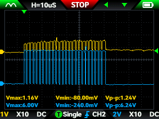

# テストの結果

結論から言うと失敗でした、、、

- 上記の空気圧センサーの使い方、正常に動いているかの検査をした。
- 基準値をこえた値と0を行ったり来たりしており測定が適切に行えない状態であると判明。
- オシロスコープでの測定を開始。

- 上がデータ入力で下がSCK（クロック）
- 平常時の測定
- 1Vと2Vでマスに対する計測結果に違いがあるものの明らかにデータ入力とSCKで波形の大きさが違う事がわかる。
- SCKの波形につられてデータ側が全て出力されているのではないのかと推測。

従って現状こちらを息の量を計測するセンサーとして使用することを断念した。